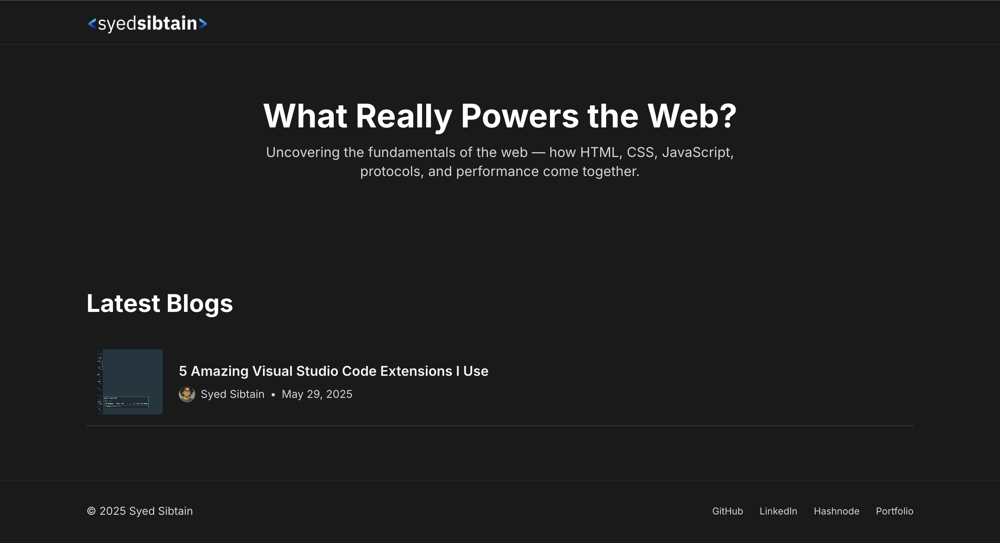
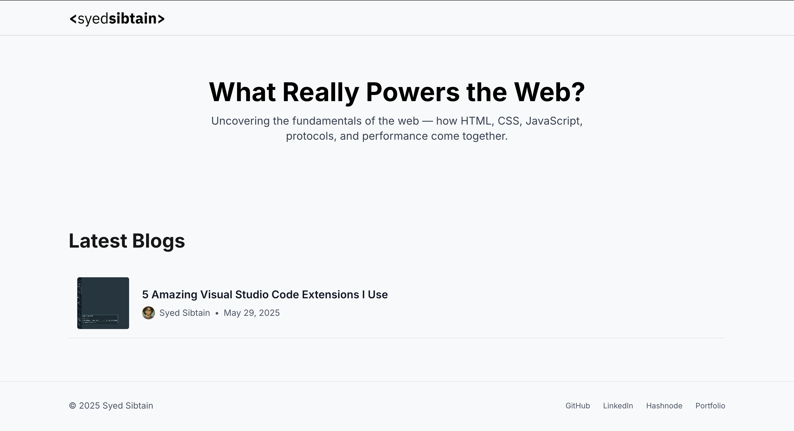
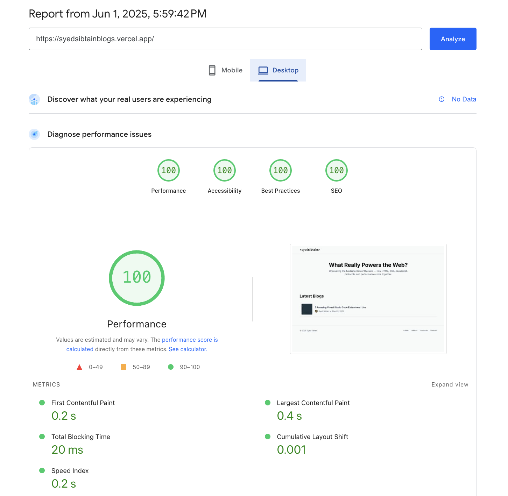
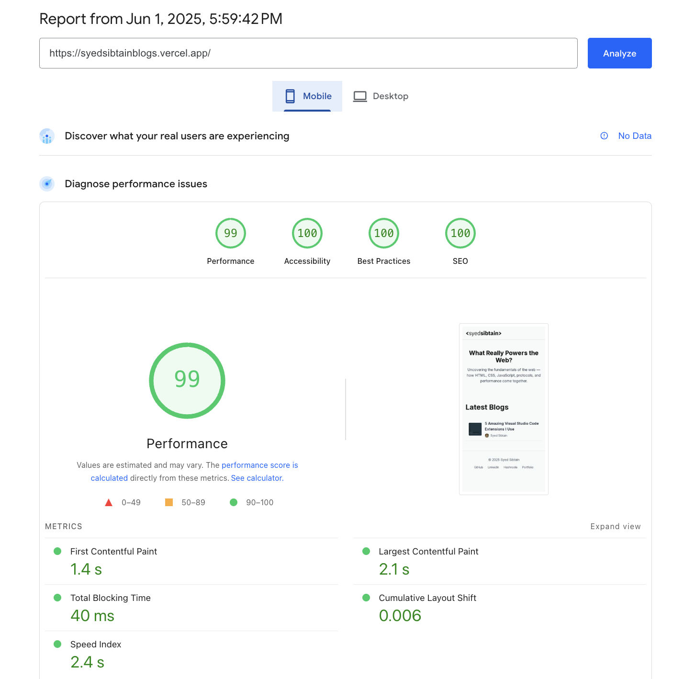

# Modern Blog Platform with Next.js and Sanity CMS

A personal blog platform built with Next.js 15 and Sanity CMS, featuring a clean, modern UI and robust content management system.

## Links

- [Live Demo](https://syedsibtainblogs.vercel.app/)
- [GitHub Repository](https://github.com/SyedSibtainRazvi/next_sanity_blog_app)

## Photos




## 🚀 MVP Features

- **Modern UI/UX**

  - Dark/Light mode system support
  - Responsive design for all devices
  - Clean, minimalist interface
  - Smooth animations and transitions

- **Content Management**

  - Sanity Studio integration
  - Rich text editor support
  - Image optimization and management
  - Author profiles with metadata

- **Technical Features**
  - TypeScript for type safety
  - Tailwind CSS for styling
  - SEO optimized with metadata
  - Responsive images
  - Fast page loads

## InSights




## 🛠️ Tech Stack

- Next.js 15
- Sanity CMS
- TypeScript
- Tailwind CSS
- Heroicons

## 🚀 Coming Soon

- Static Site Generation (SSG)
- Preview Mode
- Search functionality
- Newsletter subscription

## 🚀 Getting Started

1. Clone the repository

```bash
git clone https://github.com/SyedSibtainRazvi/next_sanity_blog_app.git
```

2. Install dependencies

```bash
npm install
```

3. Set up environment variables

```bash
cp .env.example .env.local
```

4. Run the development server

```bash
npm run dev
```

5. Open [http://localhost:3000](http://localhost:3000) in your browser

## License

MIT License - feel free to use this project for your own blog!
